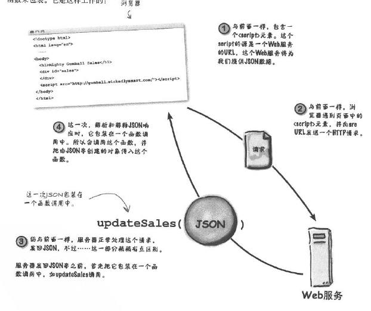

# JavaScript 

## INDEX

####[Chapter 1-2](#Chapter1-2)

- [HTML标记和JS的关系](#HTML标记和JS的关系)
- [加载顺序](#加载顺序)
- [数组](#数组)
- [字符串加法](字符串加法)
- [DOM](#DOM(Document Object Model))


####[Chapter3: 事件和处理程序](#Chapter3)

####[Chapter4：函数、变量和对象](#Chapter4：函数、变量和对象)

- [函数](#函数)

- [对象](#对象)

  ​

####[Chapter5: Map API](#Chapter5: Map API)

- [XMLHttpRequest](#XMLHttpRequest)
- [URL](#URL)

####[Chapter6: 通信 API](#Chapter6: 通信 API)

### 附录

URL参数


#Chapter1-2

##HTML标记和JS的关系

**建立元素（HTML标记）和变量（JavaScript对象）的映射。**

JS通过*DOM*来访问HTML标记

具体方式有

```javascript
var Name = document.getElementById("idName")

```

****


## DOM(Document Object Model)

文档对象模型

## 加载顺序

在页面加载之前就执行CODE的话会导致无法读取标签对象


## 数组


#### 新建数组 

```javascript
var arrayName = new Array();

```


#### 数组属性

```javascript
var arr1 = new Array();
var ran1 = Math.floor(Math.random() * arr1.length);//数组的长度

```


## 字符串加法

```javascript
"String" + Integer = "StringInerger"

```


## Math库

```javascript
Math.random() //生成0-1之间的随机数
Math.floor//去掉小数部分

```


--------

# Chapter3

## 创建元素和插入位置

```javascript
var li = document.createElement("li");//创建元素。
li.innerHTML = songName;//向元素内添加内容。
var ul = document.getElementById("ul");//得到父元素。
ul.appendChild(li);//添加子元素
```


## playlist事件触发

```javascript
function init(){
    var button = document.getElementById("addSong");//获得按钮元素->对象
    button.onclick = handleButtonClick;//设置button的onclick属性为函数名，点击button时触发handleButtonClick函数。
}window.onload = init;//先加载页面再加载init。

function handleButtonClick(){
    var textInput = document.getElementById("songTextInput");//得到用户输入元素->对象
    var songName = textInput.value;//7-8行需要理解<form>。得到用户输入对象的value(即内容)属性(property)；
    var li = document.createElement("li");//创建元素。
    li.innerHTML = songName;//向元素内添加内容。
    var ul = document.getElementById("ul");//得到父元素。
    ul.appendChild(li);//添加子元素。
}
```


## 事件关联触发【重要】

```javascript
window.onload
XMLHttpRequest.onload
button.onclick
```


## onload

XMLHttpRequest 对象的 onload 回调函数是在异步请求加载完成后所执行的函数，当JavaScript 监测到请求的数据全部传输完成后就会触发该函数。而 open() 函数设置异步请求的 method、URL 和同步方式等参数，执行 open() 后再执行 send() 函数才开始向服务器发送请求。

还有一些误解需要澄清一下，

1. window.onload 回调函数其实是在页面加载完成后（包括图片内容的显示）才会执行，并不是页面加载的等待过程中就执行。
2. request.open() 并没有发送请求，只是设置一些参数，在 send() 时才会发送（注意不要漏写这条语句），发送后就会进入 readyState 监听状态，当 readyState 的值有改变就会执行 onreadystatechange 回调函数，当异请求的步数据接收完成（即 readyState 变为 4）后就会执行 onload 回调函数（注意仅在 XHR2 中有效）


## Form

```Html
<form>
<input type="text" id="songTextInput" size="40" placeholder="Song name">//用户输入
<input type="button" id="addButton" value="Add Song">//按钮
</form>
```


---

#Chapter4：函数、变量和对象

## 函数和属性

```javascript
var textInput = document.getElementById("songTextInput");//.getElementById("songTextInput") 函数传参
button.onclick = handleButtonClick；//属性赋值
```


##函数

###定义函数

```javascript
function checkGuess(guess){//函数名和参数都是optional.
  ---code
  ---
  return whatever;//返回值可选
}
```


###函数也是值

```javascript
var f = function(){
  alert(where is my name?);
}//将函数整体赋给了f
botton.onclick = function(){
    alert(botton clicked);
}//将函数整体赋给了one of botton's propertis, which is onclick.
window.onload = checkGuess;//函数整体赋给 one of window's propertis, which is onload.
```


##参数和变量

###实参和形参

**定义**函数时指定`形参`，**调用**函数时传递`实参`。


###变量传递

向函数传递参数时，传递的是实参，但在函数体内还是形参，也就是说传递的变量值不会改变。

*不过传递数组时情况不一样。*


###局部和全局变量

- 页面存在全局变量就存在（刷新相当于重载页面），函数结束局部变量消失。
- 局部变量会“遮蔽”全局变量


## 对象

###单个对象创建

```javascript
var objectName = {                      //赋值的是引用
     property1 :"string",
     property2 : integer,
     property3 : [Array1,Array2],
     method1 : function(){
         alert(this.property1); //在对象内定义函数要用*this*指定对象名
     }
};
```

###工厂函数

 ```javascript
      function ObjectName(property1,property2,property3){			//创建工厂
          this.property1 = ;
          this.property2 = ;								    //工厂函数实际上是一个函数（废话。。）所                                                                以内部要用分号，区分于单个对象创建的逗号
          this.property3 =  {                                  //属性可以是对象
           property1 :"string",
           property2 : integer,
           property3 : [Array1,Array2],
           method1 : function(){
               alert(this.property1); 
           }
      };
          this.method = function(){
              alert(this.property);
          
          };
      }

      var instance = new ObjectName(property1,property2,property3)  //创建实例并赋引用给变量
       //所有的property都是必须的吗？
      var time = new getDate().getTime //创建实例访问属性并赋值给变量
 ```


####关于`this`

1. this的存在得以实现 objectName.method() 处理objectName的属性时无需传递参数在()中。

2. 创建实例后，实际上所有实例都共享着工厂函数里：1、属性名和key值的关系。2、方法的代码实现。//这样做增加了代码重用。

   ​


### 调用属性或者方法

```javascript
var property1 = name.property1;
var property2 = name.property2;
var property3 = name.property3;
name.method1();                 //
```


### 对象作为参数传递

在创建对象时候对象将<u>引用</u>赋给了`变量`，所以传递实参实质上传递了引用，即在函数内部形参也等于引用，并且和`实参`指向了同一`对象`，所以`形参`的任何改变都会反映到原本传入的`变量`引用的`对象`上。


## 函数、变量和对象的关系

- 变量储存1、数据类型的值比如：数，串和数组。2、对象的引用

- 函数1、传入、加工、传出（optional）参数（变量的值）2、传入对象的引用，加工对象。

- 对象封装变量和函数作为对象的属性和方法，属性是变量，方法是函数。

  ​


---


# Chapter5: Map API

#Chapter6: 通信 API


## XMLHttpRequest

触发顺序：request.open -> request.send ->request.onload

```javascript
window.onload = function(){          //类似于main函数
    var url = "http://";
    var request = new XMLHttpRequest();
    request.onload = function(){    //send request后触发
        if(request.status == 200){  //成功取回数据
          displayLuck(request.responseText);//取回的数据
        }；
    }
    request.open = ("GET",url);   //初始化request
    request.send = (null);        //发送request
}
```


##URL
> ​        统一资源定位符是对可以从互联网上得到的资源的位置和访问方法的一种简洁的表示，是互联网上标准资源的地址。互联网上的每个文件都有一个唯一的URL，它包含的信息指出文件的位置以及浏览器应该怎么处理它。
>
> ### 绝对URL
>
> ​       绝对URL（absolute URL）**显示文件的完整路径**，这意味着绝对URL本身所在的位置与被引用的实际文件的位置无关，
>
> ### 相对URL
>
> ​        相对URL（relative URL）**以包含URL本身的文件夹的位置为参考点**，描述目标文件夹的位置。如果目标文件与当前页面（也就是包含URL的页面）在同一个目录，那么这个文件的相对URL仅仅是文件名和扩展名，如果目标文件在当前目录的子目录中，那么它的相对URL是子目录名，后面是斜杠，然后是目标文件的文件名和扩展名。
>
> ​        如果要引用文件层次结构中更高层目录中的文件，那么使用两个句点和一条斜杠。可以组合和重复使用两个句点和一条斜杠，从而引用当前文件所在的硬盘上的任何文件，
>
> ​        一般来说，对于同一服务器上的文件，应该总是使用相对URL，它们更容易输入，而且在将页面从本地系统转移到服务器上时更方便，只要每个文件的相对位置保持不变，链接就仍然是有效地。


## Json


## 跨域访问

###概述

如果页面在服务器 1 上，数据在服务器 2 上。根据**浏览器安全策略**用XMLHttpRequest就无法在服务器 1 上得到服务器 2 的数据。

### 解决：JSONP

JSONP是一种使用`<script>`标记获取JSON对象（数据）的方法。



##回调函数

```javascript
function updateSales(JSON){//回调函数  url参数 callback=updateSales
  for(var i = 0;i < Datas.length;i++){ //从0开始 所以<length
    Data = Datas[i];
    Data
  }
}
```

## 定时器

```javascript

```

## 脚本插入

用新的URL替换src属性，浏览器不会把他看作是一个新的script元素，所以不会发出请求获取JSONP，要强制浏览器做出请求，必须创建这个新的script元素。这种技术称为“脚本插入”。

## 浏览器缓存

在URL末尾添加随机数，web服务器会忽略，但是能骗过浏览器